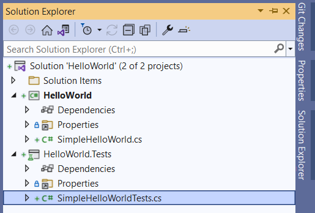

# Hello, world!

Задание начального уровня для отработки навыка управления задачами в AutoCode и запука юнит тестов в Visual Studio.

Переводы: [Английский](README.md).

Время на выполнение задания - 1h.

Для сборки проектов требуется установленный .NET 6 SDK.

## Описание задания

В этом задании нет задач на кодирование, только работа с Visual Studio.

1. Откройте вкладку [Solution Explorer](https://docs.microsoft.com/ru-ru/visualstudio/ide/solutions-and-projects-in-visual-studio#solution-explorer).
    * Выберите элемент меню - _View\Solution Explorer_.
    * Или используйте сочетание клавиш - _Ctrl+Alt+L_ (сочетания клавиш могут отличаться в разных версиях Visual Studio. См. статью [Сочетания клавиш в Visual Studio](https://docs.microsoft.com/ru-ru/visualstudio/ide/default-keyboard-shortcuts-in-visual-studio)).

2. Найдите во вкладке Solution Explorer проекты "HelloWorld" и "HelloWorld.Tests".

3. Разверните проект "HelloWorld" и найдите в проекте файл [SimpleHelloWorld.cs](HelloWorld/SimpleHelloWorld.cs). Откройте файл в редакторе.

4. Разверните проект "HelloWorld.Tests" и найдите в проекте файл [SimpleHelloWorldTests.cs](HelloWorld.Tests/SimpleHelloWorldTests.cs). Откройте файл в редакторе.

5. [Соберите решение](https://docs.microsoft.com/ru-ru/visualstudio/ide/building-and-cleaning-projects-and-solutions-in-visual-studio).
    * Выберите элемент меню - _Build\Build Solution_.
    * Или используйте сочетание клавиш - _Ctrl+Shift+B_.

6. Откройте вкладку [Error List](https://docs.microsoft.com/ru-ru/visualstudio/ide/find-and-fix-code-errors#review-the-error-list).
    * Выберите элемент меню - _View\Error List_.
    * Или используйте сочетание клавиш - _Ctrl+\\, E_.

Убедитесь, что во вкладке нет проблем (ошибок или предупреждений), которые смог обнаружить компилятор C#.

7. Откройте вкладку [Test Explorer](https://docs.microsoft.com/ru-ru/visualstudio/test/run-unit-tests-with-test-explorer). 
    * Выберите элемент меню - _Tests\Test Explorer_.
    * Или используйте сочетание клавиш - _Ctrl+E, T_.

Все тесты в списке тестов имеют голубую иконку с восклицательным знаком. Это значит, что тесты не были запущены.

8. Выберите элементе "HelloWorld.Tests" в списке тестов, нажмите на нем правой кнопкой мыши и выберите в меню "Run".
    * Или используйте сочетание клавиш - _Ctrl+R, T_.

Все элементы в списке станут "ЗЕЛЕНЫМИ".

9. Разверните список, если необходимо. Нажмите правой клавишей на тесте "ReturnHelloWorld" и выберите в меню "Run". Выбранный элемент останется "ЗЕЛЕНЫМ".
    * Или используйте сочетание клави - _Ctrl+R, T_.

10. Запустите все юнит-тесты.
    * Выберите элемент меню - _Test\Run All Tests_.
    * Или используйте сочетание клавиш - _Ctrl+R, A_.

## Дополнительная информация

* Visual Studio
  * [Getting Started with Visual Studio 2019](https://www.youtube.com/watch?v=1CgsMtUmVgs)
  * [Default keyboard shortcuts in Visual Studio](https://docs.microsoft.com/ru-ru/visualstudio/ide/default-keyboard-shortcuts-in-visual-studio)
