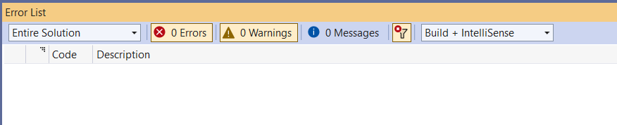

# Hello, world!

Beginner level task for practicing AutoCode task management and running unit tests in Visual Studio.

Translations: [Russian](README-RU.md).

Estimated time to complete the task - 0.5h.

The task requires .NET 6 SDK installed.

## Task Description

This task doesn’t require coding. The goal is to get familiar with basic functions of Visual Studio.

1. Open a [Solution Explorer](https://docs.microsoft.com/en-us/visualstudio/ide/solutions-and-projects-in-visual-studio#solution-explorer).
    * Click on the menu item - _View\Solution Explorer_.
    * Or use the default keyboard shortcut - _Ctrl+Alt+L_ (various versions of Visual Studio may have different keyboard shortcuts. See [Keyboard shortcuts in Visual Studio](https://docs.microsoft.com/en-us/visualstudio/ide/default-keyboard-shortcuts-in-visual-studio) article).

2. Find the "HelloWorld" and "HelloWorld.Tests" projects in the Solution Explorer view.

3. Open the "HelloWorld" project and find the [SimpleHelloWorld.cs](HelloWorld/SimpleHelloWorld.cs) file in the project. Open the file in the editor window.

4. Open the "HelloWorld.Tests" project and find [SimpleHelloWorldTests.cs](HelloWorld.Tests/SimpleHelloWorldTests.cs) file in the project. Open the file in the editor window.

5. [Build the solution](https://docs.microsoft.com/en-us/visualstudio/ide/building-and-cleaning-projects-and-solutions-in-visual-studio).
    * Click on the menu item - _Build\Build Solution_.
    * Or use the default keyboard shortcut - _Ctrl+Shift+B_.

6. Open the [Error List](https://docs.microsoft.com/en-us/visualstudio/ide/find-and-fix-code-errors#review-the-error-list) view.
    * Click on the menu item - _View\Error List_.
    * Or use the default shortcut - _Ctrl+\\, E_.

Make sure there are no compiler issues (warnings or errors).

7. Open [Test Explorer](https://docs.microsoft.com/ru-ru/visualstudio/test/run-unit-tests-with-test-explorer). 
    * Click on the menu item - _Tests\Test Explorer_.
    * Or use the default keyboard shortcut - _Ctrl+E, T_.

All tests in the test list have blue icon with a white exclamation mark. It means that the unit tests were not run.

8. Right click on the "HelloWorld.Tests" list item and click on the "Run" menu item.
    * Or use the default shortcut - _Ctrl+R, T_.

All list items should be marked "GREEN".

9. Unfold the list in the Test Explorer (if necessary), right click on the "ReturnHelloWorld" unit test, and click on the "Run" menu item. The selected list item should remain "GREEN".
    * Or use the default shortcut - _Ctrl+R, T_.

10. Run all unit tests.
    * Click on the menu item - _Test\Run All Tests_.
    * Or use the defaul keyboard shortcut - _Ctrl+R, A_.

## See also

* Visual Studio
  * [Getting Started with Visual Studio 2019](https://www.youtube.com/watch?v=1CgsMtUmVgs)
  * [Default keyboard shortcuts in Visual Studio](https://docs.microsoft.com/en-us/visualstudio/ide/default-keyboard-shortcuts-in-visual-studio)
